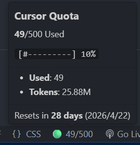

# Cursor Usage Tracker

<p align="center">
  <strong>一个在状态栏直接显示 Cursor 配额使用情况的 VS Code / Cursor 扩展。</strong><br>
  不用再靠猜，也不用翻日志；已用多少、还剩多少，一眼就能看到。
</p>

<p align="center">
  <a href="README.md"></a>
  
  
  
  
</p>

<p align="center">
  <a href="#快速开始"></a>
  <a href="#截图预留"></a>
  <a href="#工作原理"></a>
  <a href="#常见问题"></a>
</p>

这个项目是给重度 Cursor 用户准备的。很多人并不是不关心配额，而是总要等到快用完了才意识到问题来了。这个扩展把最关键的数字放回编辑器状态栏里：比如 `🟢 120/500`。你把鼠标悬停上去，还能看到请求数、Token 使用量和预计重置时间。

> [!IMPORTANT]
> 这不是官方 Cursor 扩展。它会读取本机 Cursor 数据，并请求用量相关接口（老接口 `GET https://cursor.com/api/usage`、新用量 `POST https://api2.cursor.sh/.../GetCurrentPeriodUsage`，以及 `GET https://cursor.com/api/auth/stripe` 获取计划信息）。

## 目录

- [Cursor Usage Tracker](#cursor-usage-tracker)
  - [目录](#目录)
  - [截图预留](#截图预留)
  - [这个项目解决了什么问题](#这个项目解决了什么问题)
  - [功能亮点](#功能亮点)
  - [支持的账号类型（双轨制）](#支持的账号类型双轨制)
  - [状态栏格式](#状态栏格式)
  - [快速开始](#快速开始)
    - [方式一：通过 VSIX 安装](#方式一通过-vsix-安装)
    - [方式二：开发模式运行](#方式二开发模式运行)
  - [你会看到什么](#你会看到什么)
  - [配置项](#配置项)
  - [工作原理](#工作原理)
  - [存储路径](#存储路径)
    - [用户 ID 查找路径](#用户-id-查找路径)
    - [Access Token 查找路径](#access-token-查找路径)
  - [常见问题](#常见问题)
    - [状态栏显示 `No ID`](#状态栏显示-no-id)
    - [状态栏显示 `Failed`](#状态栏显示-failed)
    - [大数据库 fallback 没生效](#大数据库-fallback-没生效)
  - [项目结构](#项目结构)
  - [开发](#开发)
  - [更新记录](#更新记录)
    - [1.1.4](#114)
    - [1.1.3](#113)
    - [1.1.2](#112)
    - [1.1.1](#111)
    - [1.1.0](#110)
    - [1.0.3](#103)
    - [1.0.2](#102)
    - [1.0.1](#101)
  - [License](#license)

## 截图预留



## 这个项目解决了什么问题

Cursor 配额这件事，平时不看还好，一旦要用的时候往往已经接近上限了。这个扩展做的事情很直接：把配额使用情况持续放在你眼前，不需要反复打开网页、翻本地文件，或者等请求失败了才知道出问题。

另外它还处理了一个比较烦、但真实存在的边缘场景：`state.vscdb` 过大。自 `1.0.2` 起，如果 Node.js 在读取 2 GiB 及以上的 SQLite 文件时命中 `ERR_FS_FILE_TOO_LARGE`，扩展会自动切到 Python `sqlite3` 回退方案，不至于直接失效。

## 功能亮点

- 状态栏实时显示请求使用情况
- 通过颜色区分低、中、高使用率
- 悬停查看用量摘要、周期与重置时间；USD 账号展示 Total / Auto / API 条形图
- 默认每 5 分钟自动刷新
- 自动从本地 Cursor 存储中查找用户 ID
- 自动从 `state.vscdb` 读取 `accessToken`
- 支持超大 SQLite 文件的自动 fallback
- 配置简单，不依赖额外服务

## 支持的账号类型（双轨制）

本插件自动识别账号属于哪种 Cursor 计费模型并选对应展示：

### 请求次数模型（老账号，500/2000 次/月）

| 账号 | 显示示例 |
|---|---|
| Pro 老账号 | `🟢 0/500` |
| Business 老账号 | `🟡 1200/2000` |

### USD Credit 模型（新账号，2025 末迁移）

| 账号 | 状态栏 `amount` 典型示例 |
|---|---|
| Free | `🔵 Free` |
| Pro ($20/月) | `🟢 $0.00/$20`（无 API 分路字段时与以前一致，按 **total**） |
| Pro+ ($60/月, $70 included) | `🟢 $0.00/$70` |
| Ultra ($200/月, $400 included) | 若接口返回 **API 占比**：例如 API **86%** 时可能显示 `🔴 $344.00/$400`（交通灯按 **API%**）。若无 `apiPercentUsed`，仍按 **total**（如 `🟢 $42.30/$400`） |
| Team 成员（个人视角） | `🟢 $0.00/$XX` |

> 「老优先」策略：若老接口仍返回有效次数（`maxRequestUsage > 0`），优先按请求次数展示；否则切到 USD credit。老用户体验完全不变。

> 状态栏上的 **API 金额** 在存在 `apiPercentUsed` 时为：`included 额度 limit × (API% / 100)`，分母仍是同一档 **Included** 上限；这是与官网「API 占比」对齐的**线性折算**，若与账单细项有微小差异，以 Cursor 网页为准。

> 数据来源为 Cursor 浏览器同款的内部接口，未官方公开，可能随版本变化。

## 状态栏格式

可在 settings 里通过 `cursorUsageTracker.statusBarFormat` 选 4 种模板：

- `percent` — 仅百分比。USD：有 **`apiPercentUsed`** 时默认显示 **API%**，否则 **total%**（如 `🟢 11%` 或 `🔴 86%`）
- `amount`（默认）— 金额或次数。USD：有 API 分路时分子为 **按 API% 折算到同一 included 额度上的金额**，否则为 **total 已用金额**；老账号仍为 `🟢 0/500`
- `amount_with_reset` — 同 `amount` 并加重置倒计时（如 `🟢 $42.30/$400 ·7d`）
- `amount_with_plan` — 同 `amount` 并加计划名（如 `🟢 Ultra $42.30/$400`）

黄灯 / 红灯阈值（`cautionThreshold` / `warningThreshold`）作用于**状态栏正在用的那一档百分比**（有 API 分路时为 **API%**，否则为 **total%**）。

## 快速开始

### 方式一：通过 VSIX 安装

先在本地打包扩展：

```bash
npm install
npm run compile
npm run package
```

打包完成后，项目根目录会生成类似 `cursor-usage-tracker-1.0.3.vsix` 的文件。

然后在 Cursor 或 VS Code 中安装：

1. 打开命令面板：Windows / Linux 用 `Ctrl+Shift+P`，macOS 用 `Cmd+Shift+P`
2. 执行 `Extensions: Install from VSIX...`
3. 选择刚生成的 `.vsix` 文件
4. 如有需要，重启编辑器

### 方式二：开发模式运行

```bash
git clone https://github.com/Tendo33/cursor-usage-tracker.git
cd cursor-usage-tracker
npm install
npm run compile
```

然后在 VS Code 或 Cursor 中按 `F5`，启动 Extension Development Host。

## 你会看到什么

扩展启动后，状态栏可能出现这些状态：

**老账号（请求次数模型）：**

- `🟢 120/500`：使用率较低
- `🟡 260/500`：使用率中等
- `🔴 410/500`：使用率较高

**新账号（USD credit 模型）：**

- `🟢 $42.30/$400`：仅有 **total** 分路数据时的 Ultra（等与旧版一致）
- `🔴 $344.00/$400`：Ultra 且 Cursor 返回 **API** 分路（例如 API 86%，若超过你配置的 `warningThreshold` 则为红灯）
- `🟡 $14.00/$20`：Pro 接近黄灯（无 API 分路时按 total）
- `🔴 $18.00/$20`：Pro 接近红灯
- `🔵 Free`：Free 用户（无固定 limit）

**通用状态：**

- `$(sync~spin) Loading...`：正在拉取数据
- `$(warning) No ID`：没有在本地读到用户 ID
- `$(warning) Re-login`：session 过期，需要重新登录 Cursor
- `$(warning) Network`：所有接口都失败，请查看日志
- 末尾带 ` …`：部分接口失败，但仍能展示其它数据

鼠标悬停后会显示：

- 计划名 + 订阅状态（active / trialing / cancelled / past_due）
- **USD credit：** 等宽 `text` 代码块内展示 **Included pool**（`$已用 / $上限`，**total%**），以及 **Total / Auto + Composer / API**（标题左对齐填充 + 24 格 ASCII 条）；分路缺失时条末为 `—`。**Renews：** 仅周期结束日期（不显示起止区间与「还剩几天」）
- **老请求次数模型：** 已用 / 上限 / 百分比 + 一条进度条；**Renews：** 仅周期结束日
- 预付余额（如果有）
- 警告列表（超额 / 付款失败 / 即将取消 / 试用中等）

## 配置项

| 配置项 | 类型 | 默认值 | 说明 |
| --- | --- | --- | --- |
| `cursorUsageTracker.refreshInterval` | `number` | `300` | 自动刷新间隔，单位为秒 |
| `cursorUsageTracker.showInStatusBar` | `boolean` | `true` | 是否在状态栏显示配额信息 |
| `cursorUsageTracker.statusBarFormat` | `string` | `amount` | 状态栏显示模板，4 选 1：`percent` / `amount` / `amount_with_reset` / `amount_with_plan` |
| `cursorUsageTracker.cautionThreshold` | `number` | `40` | 黄灯阈值（百分比），用量达到该值显示黄色 |
| `cursorUsageTracker.warningThreshold` | `number` | `70` | 红灯阈值（百分比），用量达到该值显示红色 |
| `cursorUsageTracker.showOverLimitToast` | `boolean` | `false` | 超额时弹系统通知（默认关，避免打扰） |

示例：

```json
{
  "cursorUsageTracker.refreshInterval": 180,
  "cursorUsageTracker.showInStatusBar": true,
  "cursorUsageTracker.statusBarFormat": "amount_with_plan",
  "cursorUsageTracker.cautionThreshold": 50,
  "cursorUsageTracker.warningThreshold": 80,
  "cursorUsageTracker.showOverLimitToast": true
}
```

## 工作原理

这个扩展做的事情其实很朴素：

1. 从本地 Cursor 存储里找出用户 ID，优先检查新的 `sentry` 路径。
2. 从 Cursor 的 `state.vscdb` 中读取 `cursorAuth/accessToken`。
3. **并行**请求老用量、当前周期用量（含 USD / limit / API–Auto 分路）与 Stripe 会员信息，合并为一份快照后渲染状态栏与悬停卡片。

请求形式如下：

```text
GET https://cursor.com/api/usage?user={userId}
Cookie: WorkosCursorSessionToken={userId}%3A%3A{accessToken}
```

对于普通大小的数据库，扩展会使用 `sql.js` 读取 SQLite。若文件过大导致 `readFileSync` 无法处理，则会自动切换到 Python：

- Windows：依次尝试 `python`、`py`、`python3`
- macOS / Linux：依次尝试 `python3`、`python`

## 存储路径

### 用户 ID 查找路径

- Windows: `%APPDATA%\Cursor\sentry\scope_v3.json`
- Windows: `%APPDATA%\Cursor\sentry\session.json`
- Windows 旧路径: `%APPDATA%\Cursor\User\globalStorage\storage.json`
- macOS: `~/Library/Application Support/Cursor/sentry/*.json`
- Linux: `~/.config/Cursor/sentry/*.json`

### Access Token 查找路径

- Windows: `%APPDATA%\Cursor\User\globalStorage\state.vscdb`
- macOS: `~/Library/Application Support/Cursor/User/globalStorage/state.vscdb`
- Linux: `~/.config/Cursor/User/globalStorage/state.vscdb`

## 常见问题

### 状态栏显示 `No ID`

这表示扩展没有在本地 Cursor 数据中找到合法的 `user_*` 标识。常见原因一般就这几种：

- 当前机器上的 Cursor 还没有完成登录
- 你的安装环境里存储路径发生了变化
- 本地文件存在，但里面没有当前实现预期的字段

可以打开命令面板，执行 `Cursor Usage Tracker: 查看 Cursor Usage Tracker 日志`，查看具体查找过程。

### 状态栏显示 `Failed`

这说明接口请求没有拿回可用结果。常见原因包括：

- 无法从 `state.vscdb` 读到 access token
- 本地 token 已过期，自动重试也没恢复
- 上游接口格式发生变化，当前解析逻辑失效

### 大数据库 fallback 没生效

当 `state.vscdb` 达到 2 GiB 或更大时，扩展会依赖本地 Python 解释器做回退读取。请确认你的机器上至少存在以下命令之一：

- `python`
- `py`
- `python3`

如果都没有，安装 Python 3 后再刷新即可。

## 项目结构

```text
cursor-usage-tracker/
├── README.md / README_CN.md / CHANGELOG.md
├── src/
│   ├── extension.ts        # vscode 入口，状态栏 + 配置 + 调度
│   ├── auth.ts             # userId / accessToken / cookie 提取
│   ├── cursorApi.ts        # 三接口客户端 + retry + mergeIntoSnapshot
│   ├── render.ts           # 状态栏渲染纯函数（双 model × 4 模板）
│   ├── types.ts            # AccountSnapshot 等类型定义
│   └── sql.js.d.ts
├── tests/
│   ├── auth.test.js
│   ├── cursorApi.{legacy,fetch,stripe,retry}.test.js
│   ├── render.test.js
│   └── fixtures/           # USD + legacy 账号样本
├── out/                    # esbuild 产物
├── out-tests/              # tsc 测试产物
├── esbuild.mjs
├── tsconfig.json / tsconfig.test.json
├── package.json
└── assets/
```

## 开发

常用命令：

```bash
npm install
npm run compile         # 用 esbuild 构建扩展
npm run watch           # 监听变更自动重建
npm test                # 编译并运行单元测试（40 个）
npm run package         # 生成 .vsix
```

## 更新记录

### 1.1.4

- **变更：** 悬停去掉 `Billing model`；**Renews** 仅显示周期结束日；USD 用量用等宽 `text` 块 + **24 格**条与标题填充对齐；Legacy 悬停条宽与 **Renews** 行为对齐。
- **文档：** 中英文 README 与上述一致。

### 1.1.3

- **变更：** 存在 `apiPercentUsed` 时状态栏**默认以 API 分路**为主；悬停卡片含 **Included pool** 与 **Total / Auto / API** 三组条形图；设置项说明已同步。
- **文档：** 更新中英文 README（接口说明、阈值含义、悬停结构等）。

### 1.1.2

- **修复：** Ultra 等账号若接口不再返回 `planUsage.remaining`，用 `limit` 与 `totalPercentUsed`（及可选 `planUsage.used`）推算已用金额，避免出现 `$0.00` 与非零 total% 不一致。

### 1.1.1

- USD 悬停展示 API / Auto 分路占比（来自 Cursor 字段）。

### 1.1.0

- 新增双轨制：同时支持「请求次数」和「USD credit」两种 Cursor 计费模型，自动识别账号
- 4 档显示模板（percent / amount / amount_with_reset / amount_with_plan）
- 新增可配置阈值（warningThreshold / cautionThreshold）和超额 toast 开关
- 三接口并行调用 + 401 自动重试 + partial 数据 `…` 后缀
- 代码拆分为 `auth.ts` / `cursorApi.ts` / `render.ts` / `extension.ts` / `types.ts`
- **老用户体验完全不变**（「老优先」策略保证 v1.0.x 行为）

### 1.0.3

- 为 Cursor 用量 API 的瞬时 TLS / 网络失败增加自动重试
- 为请求增加超时控制，避免刷新长时间卡住
- 补充可重试网络错误的回归测试

### 1.0.2

- 修复 `state.vscdb >= 2 GiB` 时的读取失败问题
- 增加 Python `sqlite3` 回退读取
- 改进日志和失败处理

### 1.0.1

- 初始版本发布

## License

[MIT](LICENSE)
